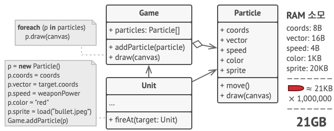
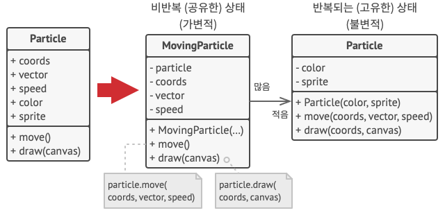
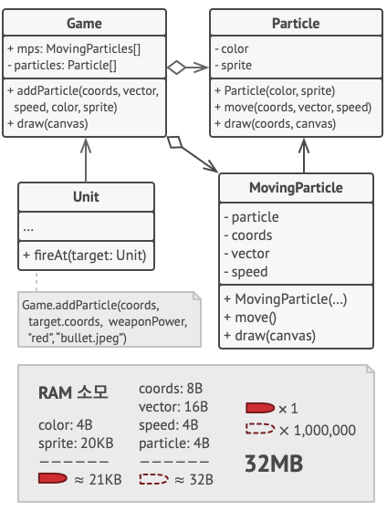
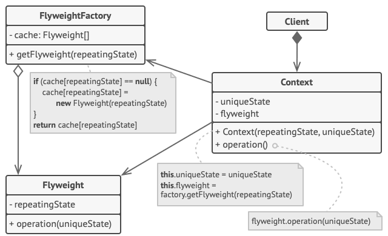

# 플라이웨이트 패턴

플라이웨이트 패턴은 각 객체에 모든 데이터를 유지하는 대신 여러 객체들 간에 상태의 공통 부분을 공유하여 
사용할 수 있는 RAM에 더 많은 객체들을 포함할 수 있도록 하는 구조 디자인 패턴이다. 즉, 객체들의 공통 부분을
공유해서 사용함으로써 메모리를 절약하는 패턴이다.

[플라이웨이트 패턴](https://refactoring.guru/ko/design-patterns/flyweight)

(위 링크의 내용을 가져왔다.)

## 문제

플레이어들이 지도를 돌아다니며 서로에게 총을 쏘는 비디오 게임이 있다고 하자.
폭발로 인한 총알, 미사일 및 파편들이 지도 전체를 날아다니는 것을 구현하다고 하자.

하지만 RAM이 충분하지 않아 게임이 충돌했다고 한다.

## 해결책
`Particle` 클래스는 `color` 및 `sprite`필드들이 많은 메모리를 차지하고 있다.
또한 이 두 필드는 모든 입자에 거쳐 거의 같은 데이터를 저장하고 있다. 
예를 들어 모든 총알은 같은 색상과 스프라이트를 가진다.

좌표, 이동벡터, 속도와 같은 데이터들은 각 입자마다 고유하며 시간이 지남에 따라 변경되지만, 
색상과 스프라이트 값은 각 입자마다 일정하게 유지된다.

플라이웨이트 패턴은 객체 내부에 가변적인 데이터들의 저장을 중단하고, 대신 이 상태를 특정 메서드들에
전달할 것을 제안한다. 불변적인 상태의 데이터만 객체 내에 유지되기 때문에 해당 데이터는 다른 곳에서 재사용할 수 있다.

이렇게 불변적인 데이터만 저장하는 객체를 플라이웨이트라고 한다.

## 플라이웨이트와 불변성
같은 플라이웨이트 객체가 다른 컨텍스트들에서 사용될 수 있기 때문에 해당 플라이웨이트 객체의 상태를 
수정할 수 없는지 (불변인지) 확인해야 한다. 플라이웨이트는 생성자 매개변수를 통해 상태를 한 번만 초기화한다.
또한 setter, public 필드로 값을 노출해서는 안된다.

## 플라이웨이트 팩토리
다양한 플라이웨이트들에 보다 편리하게 액세스하기 위해 기존 플라이웨이트 객체들의 풀을 관리하는 팩토리 메서드를 생성할 수 있다. 
이 메서드는 클라이언트에서 원하는 플라이웨이트의 고유한 상태를 받아들이고 
이 상태와 일치하는 기존 플라이웨이트 객체를 찾고 발견되면 반환한다. 
그렇지 않으면 새 플라이웨이트를 생성하여 풀에 추가한다.

(JVM String Constant Pool을 생각해보자..)

## 싱글턴과의 차이점
만약 객체들의 공유된 상태들을 단 하나의 플라이웨이트로 줄일 수 있다면, 싱글턴과 유사해진다.
하지만 다음 두 가지 차이점이 있다.
1. 싱글턴은 인스턴스가 하나만 있어야 한다. 반면에 플라이웨이트 클래스는 여러 고유한 상태를 가진 여러 인스턴스를 포함할 수 있다.
2. 싱글턴 객체는 변할 수 있다 (mutable). 플라이웨이트 객체들은 변할 수 없다 (immutable).