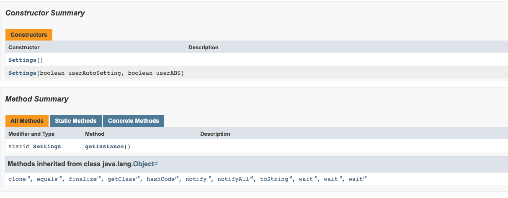

# [아이템1] 생성자 대신 정적 팩터리 메서드를 고려하라

## 학습할 것
- 정적 팩터리 메서드의 장점
- 정적 팩터리 메서드의 단점
- Enum 타입에 대해
  - Enum이란?
  - Enum만 있는 Map과 Set에서 EnumMap, EnumSet을 사용하는 것이 유리한 이유
- 플라이웨이트 패턴
- Java8이후의 인터페이스
- 리플렉션

## 정적 팩터리 메서드
정적 팩터리 메서드는 단순히 클래스의 인스턴스를 반환하는 정적 메서드이다.

이 정적 팩터리 메서드를 사용함으로써 얻을 수 있는 장점은 다음과 같다.
- 이름을 가질 수 있다.
- 호출될 때마다 인스턴스를 새로 생성하지 않아도 된다.
- 반환 타입의 하위 타입 객체를 반환할 수 있는 능력이 있다. (인터페이스)
- 입력 매개변수에 따라 매번 다른 클래스의 객체를 반환할 수 있다.
- 정적 팩터리 메서드를 작성하는 시점에는 객체의 클래스가 존재하지 않아도 된다.

### 이름을 가질 수 있다.
만약 메서드 시그니처가 같으면 생성자를 두 개 가지지 못하는데 함수에 이름을 주어 이를 해결할 수 있다.

```java
class Order {
    private boolean prime;
    private boolean urgent;
    private Product product;
    private OrderStatus orderStatus;
  
    public Order(Product product, boolean urgent) {
        this.product = product;
        this.urgent = urgent;
    }
}
```
다음과 같은 코드가 있을 때 `Product`와 `prime`을 매개변수로 받는 생성자를 추가하고 싶어도 메서드 시그니처가 같기 때문에 추가하지 못하는 문제가 있다.
하지만 다음과 같이 정적 팩터리 메서드를 통해 해결할 수 있다.

```java
class Order {
    
    // fields...
  
    public static Order primeOrder(Product product) {
        Order order = new Order();
        order.prime = true;
        order.product = product;
  
        return order;
    }

    public static Order urgentOrder(Product product) {
        Order order = new Order();
        order.urgent = true;
        order.product = product;

        return order;
    }
}
```

### 호출될 때마다 인스턴스를 새로 생성하지 않아도 된다
객체의 생성을 제어하고 싶을 때 정적 팩터리 메서드를 사용할 수 있다. 
하지만 생성자로는 인스턴스의 생성을 제어할 수 없다. (생성자가 public한 경우)
이럴 때 정적 팩터리 메서드를 통해 인스턴스를 매번 생성하지 않고 제공한다.

```java
public class Settings {
    
    private boolean userAutoSetting;
    private boolean userABS;

    private static final Settings INSTANCE = new Settings();
    
    public Settings() {}
    
    public Settings(boolean userAutoSetting, boolean userABS) {
        this.userAutoSetting = userAutoSetting;
        this.userABS = userABS;
    }
    
    public static Settings getInstance() {
        return INSTANCE;
    }
}
```

Java의 `Boolean` 클래스의 경우 인스턴스를 새로 생성하지 않고 이미 초기화된 인스턴스를 제공하고 있다.
```java
class Boolean {
    
    // ...
  
    public static Boolean valueOf(String s) {
        return parseBoolean(s) ? TRUE : FALSE;
    }
}
```

### 반환 타입의 하위 타입 객체를 반환할 수 있는 능력이 있다. & 입력 매개변수에 따라 매번 다른 클래스의 객체를 반환할 수 있다.
인터페이스 기반의 프레임워크를 사용한다면 정적 팩터리 메서드를 통해 하위 타입을 반환할 수 있게 된다.
그리고 정적 팩터리 메서드에 매개변수를 둠으로써 다른 클래스의 객체를 반환하게 할 수 있다.

```java
public interface HelloService {

    String hello();

    static HelloService of(String lang) {
        if (lang.equals("ko")) {
            return new KoreanHelloService();
        } else {
            return new EnglishHelloService();
        }
    }
}
```

Java8 이후에 추가된 인터페이스의 `static` 메서드를 통해 따로 factory 클래스를 만들 필요가 없어져 위와 같이 구성했다.

이렇게 이 유연성을 응용하면 인터페이스 기반의 프레임워크를 사용할 수 있게 해준다. 
또한 구체적인 타입을 이를 사용하는 클라이언트에게 숨길 수 있게 된다.

### 정적 팩터리 메서드를 작성하는 시점에는 객체의 클래스가 존재하지 않아도 된다.
위와 같이 `HelloService`라는 인터페이스를 정의해두고, 이를 구현하는 클래스들이 jar 파일에 있다고 가정하자.
이때 `ServiceLoader` 클래스를 이용하면 그 구현체 jar 파일을 변경하는 것만으로도 내가 원하는 구현체를 사용할 수 있다.

`ServiceLoader`는 load라는 정적 팩터리 메서드를 제공해주는데, 클래스패스 내의 모든 구현체를 가져오게 된다.

```java
class Main {

  public static void main(String[] args) {
        ServiceLoader<HelloService> loader = ServiceLoader.load(HelloService.class);
        Optional<HelloService> helloServiceOptional = loader.findFirst();
        
        helloServiceOptional.ifPresent(h -> System.out.println(h.hello()));
    }
}
```
  
하지만 이런 정적 팩터리 메서드도 단점이 존재한다.
- 상속을 하려면 public 이나 protected 생성자가 필요하니 정적 팩터리 메서드만 제공하면 하위 클래스를 만들 수 없다.
- 정적 팩터리 메서드는 프로그래머가 찾기 어렵다. (문서화)

### 상속을 하려면 public 이나 protected 생성자가 필요하니 정적 팩터리 메서드만 제공하면 하위 클래스를 만들 수 없다.
자바에서는 상속을 하기 위해서는 부모 클래스에 private 생성자를 둘 수 없기 때문에 public 이나 protected 생성자를 두어야 한다.

하지만 이렇게 되면 객체의 생성에 대한 접근을 제어할 수 없다. 그래서 컴포지션을 사용해서 이를 해결할 수 있다.

### 정적 팩터리 메서드는 프로그래머가 찾기 어렵다.
위의 `Settings` 클래스를 JavaDoc을 통해 보면 다음과 같다.



Constructor 같은 경우 별도의 컬럼이 존재해 프로그래머가 인지하기 쉽지만 우리가 생성한 `getInstance` 메서드는 메서드 컬럼에 들어가 있어 인지하기 쉽지 않다.
메서드가 이것보다 더 많아질 경우 프로그래머는 이를 인지하기 어려울 것이다.

그래서 프로그래머는 주석을 통해 getInstance 메서드에 대해 설명해 주는 것이 좋다.

이후의 내용은 추가적인 파일에 작성하겠다!